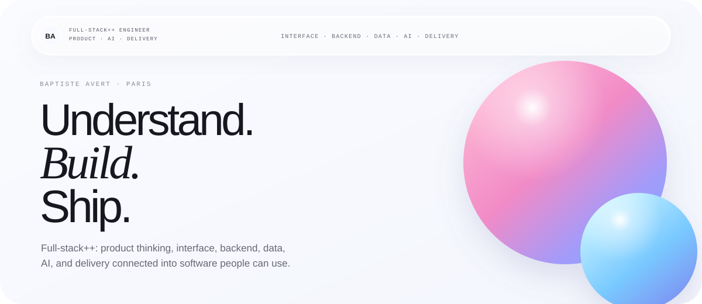
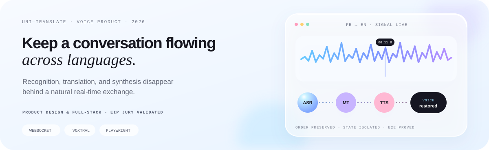
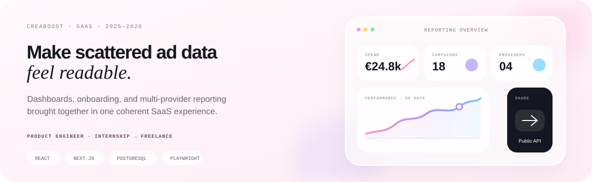
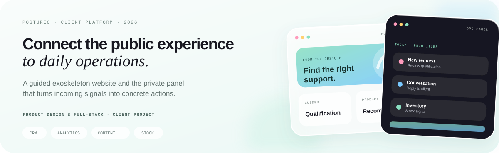
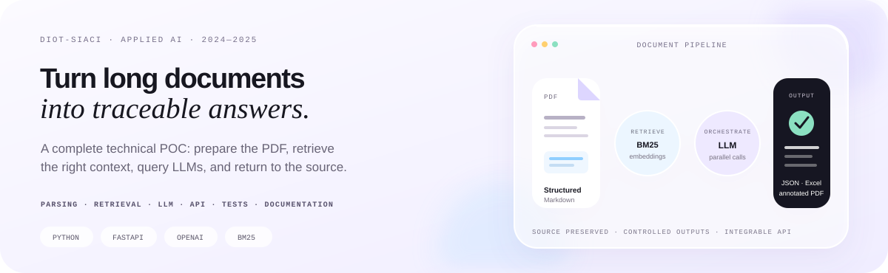
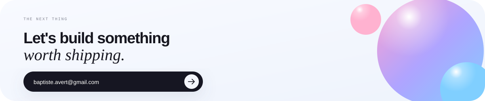

<div align="center">

<a href="https://baptiste-avert.fr">
  <picture>
    <source media="(max-width: 600px)" srcset="./assets/liquid-hero-mobile.svg">
    
  </picture>
</a>

[Portfolio](https://baptiste-avert.fr) · [LinkedIn](https://www.linkedin.com/in/baptiste-avert) · [Email](mailto:baptiste.avert@gmail.com) · [Malt](https://www.malt.fr/profile/baptisteavert)

<br>

I build product-facing systems where the **interface, backend, data, and AI tell the same story**.  
From the real user problem to the tested, shipped experience.

</div>

## Selected work

<a href="https://uni-translate.fr">
  <picture>
    <source media="(max-width: 600px)" srcset="./assets/project-uni-translate-mobile.svg">
    
  </picture>
</a>

<a href="https://www.creaboost.com">
  <picture>
    <source media="(max-width: 600px)" srcset="./assets/project-creaboost-mobile.svg">
    
  </picture>
</a>

<a href="https://dev.postureo.fr">
  <picture>
    <source media="(max-width: 600px)" srcset="./assets/project-postureo-mobile.svg">
    
  </picture>
</a>

<a href="https://baptiste-avert.fr/#experience">
  <picture>
    <source media="(max-width: 600px)" srcset="./assets/project-diot-mobile.svg">
    
  </picture>
</a>

<p align="center">
  Also shipped:
  <a href="https://baptiste-avert.fr/#work">Les Abeilles de Victoire · immersive Web 3D</a>
  &nbsp;·&nbsp;
  <a href="https://alter-finances-courtage.fr">Alter Finances · guided service</a>
  &nbsp;·&nbsp;
  <a href="https://baptiste-avert.fr">This Astro + Three.js portfolio</a>
</p>

## Technologies I use to ship

<div align="center">

**Product interfaces**

[](https://baptiste-avert.fr)

**Backend & data**

[](https://baptiste-avert.fr)

**Systems & delivery**

[](https://baptiste-avert.fr)

`OpenAI APIs` · `Playwright` · `PostHog` · `BigQuery` · `WebSocket` · `CI/CD`

<sub>Also experienced with SQL, Shell, C/ProC, Cobol, Spring Batch, PyMuPDF, pandas, TF-IDF, BM25, and embeddings.</sub>

</div>

## The experience behind the products

| When | Context | What I worked on |
| :--- | :--- | :--- |
| **2025—2026** | **CreaBoost** · Internship → freelance | SaaS dashboards, reporting engine, product analytics, E2E coverage |
| **2024—2025** | **Diot-Siaci** · Internship | Generative AI application and document-analysis POC |
| **2023** | **Sopra Steria** · Internship | Healthcare data infrastructure, collector migrations, extraction tooling |
| **2022—2027** | **EPITECH Paris** | Five-year Computer Science track · degree and RNCP level 7 in progress |
| **Exchange** | **Beijing Institute of Technology** | Computer Science, Cyber Security, and Artificial Intelligence |

## How I build

```text
real problem  →  product intent  →  interface + system + AI  →  tests  →  shipped experience
```

1. Start with the user's need and the real constraints.
2. Design the journey and the system together.
3. Build, test, ship, observe, and polish.

<div align="center">

<a href="mailto:baptiste.avert@gmail.com">
  <picture>
    <source media="(max-width: 600px)" srcset="./assets/liquid-contact-mobile.svg">
    
  </picture>
</a>

</div>
